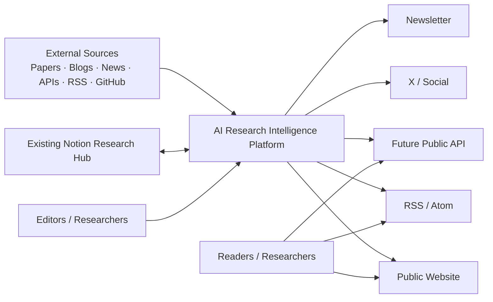

# 01 — System Context

## Boundaries

The platform owns canonical content, claims, evidence, topics, relationships, translations, publication status, and version history.

Notion remains a supported editorial input surface during migration, but it is not queried by the public website at request time.
