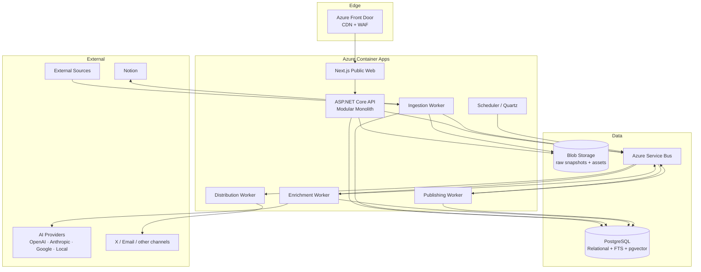

# 02 — Container Architecture

## Why modular monolith first

The API is one deployable initially, but organized into independent modules. Workers can scale independently from day one. High-throughput modules can later be extracted behind the same event contracts.
