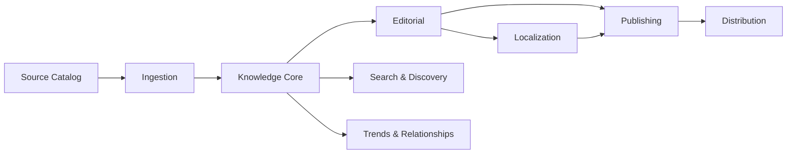

# 03 — Domain Modules

## Modules

### Source Catalog
Sources, source policies, trust/provenance metadata, fetch schedules, licensing constraints.

### Ingestion
Fetch, snapshot, normalize, fingerprint, deduplicate, canonicalize.

### Knowledge Core
Research Items, Claims, Evidence, Concepts, Entities, Sources, Citations, relationships.

### Editorial
Draft/review/approve/reject/correct workflow, editorial notes, evidence-strength review.

### Trends & Relationships
Typed edges: supports, contradicts, extends, depends_on, alternative_to, evidence_for, evidence_against.

### Localization
Canonical semantic record -> locale-specific editorial rendering.

### Publishing
Slugs, release versions, canonical URLs, sitemap, RSS/Atom, correction history.

### Distribution
X, newsletters, topic feeds, future webhooks/API subscribers.

### Search & Discovery
PostgreSQL FTS + pgvector hybrid retrieval, filters, related content and later Q&A.
