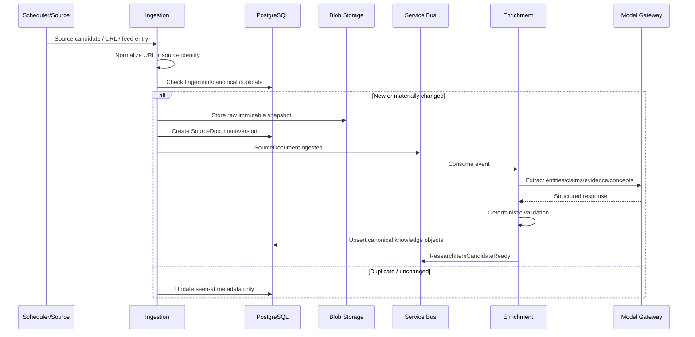

# 04 — Research Ingestion Flow

## Key rules

- Preserve immutable source snapshots for reproducibility.
- Deduplicate before expensive model inference.
- AI output never writes directly to public content.
- Claims and citations must reference source versions.
- Primary-source preference is encoded in source policy/scoring.
