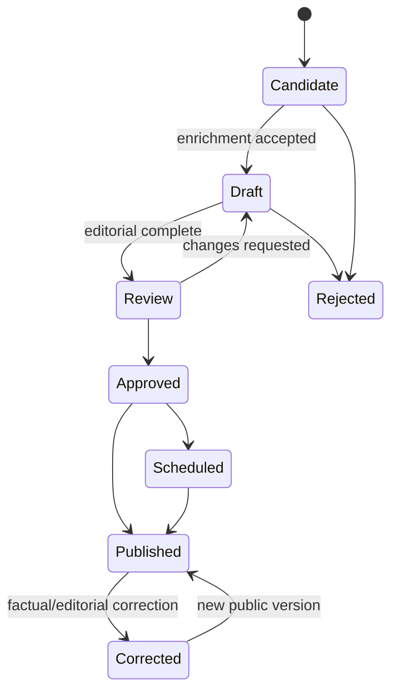
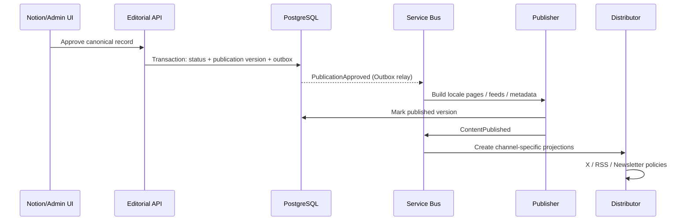

# 05 — Editorial and Publishing Flow

```mermaid
stateDiagram-v2
    [*] --> Candidate
    Candidate --> Draft: enrichment accepted
    Draft --> Review: editorial complete
    Review --> Draft: changes requested
    Review --> Approved
    Approved --> Scheduled
    Approved --> Published
    Scheduled --> Published
    Published --> Corrected: factual/editorial correction
    Corrected --> Published: new public version
    Draft --> Rejected
    Candidate --> Rejected
```

```mermaid
sequenceDiagram
    participant N as Notion/Admin UI
    participant API as Editorial API
    participant DB as PostgreSQL
    participant Q as Service Bus
    participant P as Publisher
    participant D as Distributor

    N->>API: Approve canonical record
    API->>DB: Transaction: status + publication version + outbox
    DB-->>Q: PublicationApproved (Outbox relay)
    Q->>P: Build locale pages / feeds / metadata
    P->>DB: Mark published version
    P->>Q: ContentPublished
    Q->>D: Create channel-specific projections
    D->>D: X / RSS / Newsletter policies
```

No channel owns canonical text. Distribution always references a published content version.
