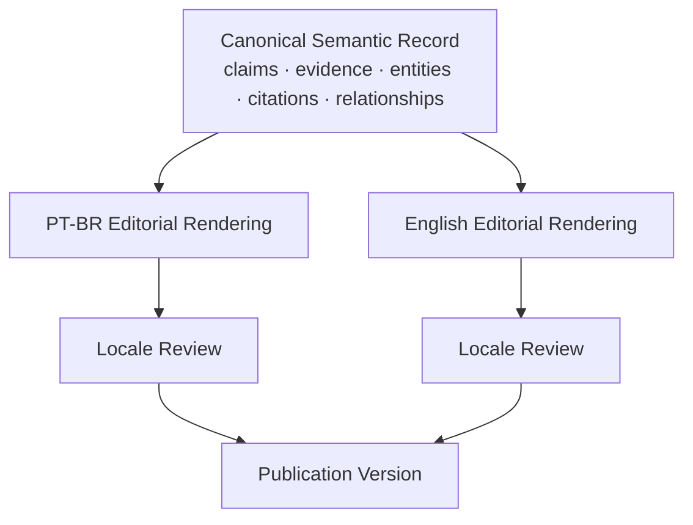

# 06 — Multilingual Content Flow

## Immutable across languages

- source citations;
- numerical evidence;
- entity identifiers;
- benchmark/model/paper names;
- evidence strength;
- typed relationships.

## Localized

- headline;
- summary;
- explanations;
- examples;
- SEO description;
- social copy.
