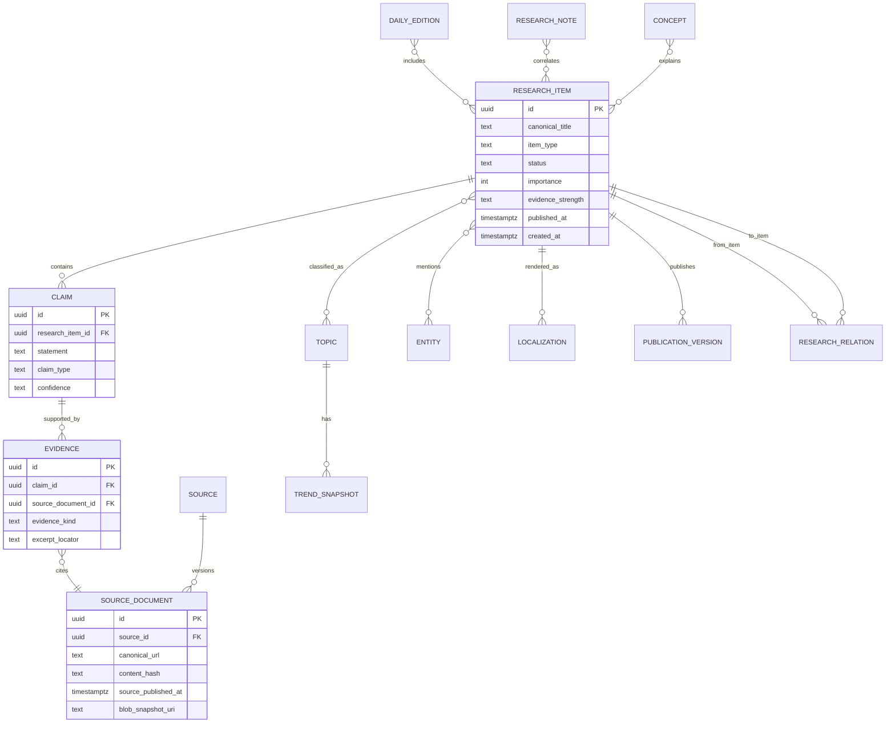

# 07 — Core Relational Data Model

## Search

- `tsvector` columns for FTS.
- `vector` columns via pgvector for semantic retrieval.
- Reciprocal-rank-fusion or weighted hybrid ranking at query time.
- Promote source/evidence/trend filters in SQL rather than a separate search datastore initially.
