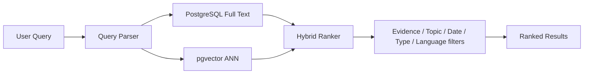

# 09 — Search Architecture

## Phase 1: PostgreSQL only

Use PostgreSQL for keyword, semantic, filters, facets, and related-content generation until measured load demonstrates a separate search engine is necessary.

## Later extraction trigger

Consider OpenSearch/Elasticsearch only if measurements show PostgreSQL cannot meet indexing/query latency, relevance experimentation, or operational isolation requirements. This is an explicit future decision, not an MVP dependency.
