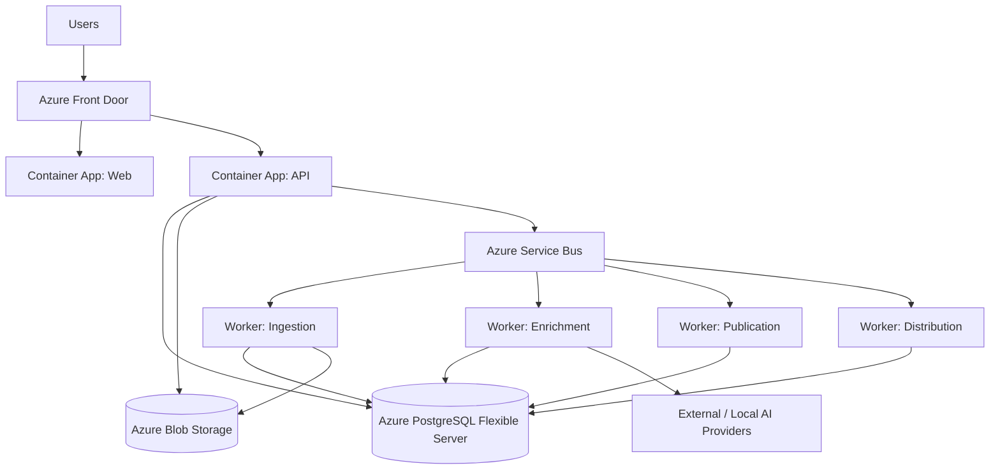

# 10 — Deployment Topology

## Scaling model

- Web/API scale horizontally on HTTP concurrency.
- Workers scale independently on Service Bus queue depth.
- PostgreSQL read replicas can be introduced for public read/search workloads.
- Blob/CDN handles immutable source/media distribution.
- Heavy enrichment is decoupled from publishing and public traffic.
