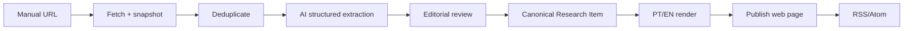

# 12 — First End-to-End Slice

Build one thin but complete path before broad ingestion.

## Acceptance criteria

1. Submit a source URL manually.
2. Persist immutable source snapshot and metadata.
3. Detect exact/material duplicates.
4. Produce typed Claim/Evidence/Concept output through a provider-independent model gateway.
5. Review/edit/approve without changing the source snapshot.
6. Publish one canonical Research Item in PT-BR and English.
7. Generate canonical URL, sitemap entry and RSS entry.
8. Record every publication version/correction.
9. Re-running any step is idempotent.
