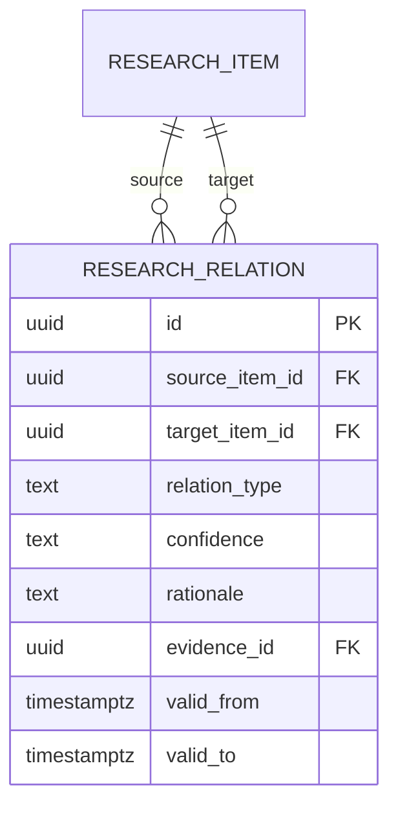

# 13 — Relationship Graph Without a Graph Database

The research graph remains relational in PostgreSQL.

Supported relation types initially:

- supports
- contradicts
- extends
- depends_on
- alternative_to
- evidence_for
- evidence_against
- caused_by
- supersedes

## Query strategy

- direct relationships: indexed joins;
- bounded graph exploration: recursive CTEs;
- popular topic graphs: materialized projections/views;
- semantic discovery: pgvector candidates followed by relational validation;
- public visualization payloads: precomputed JSON projections generated from relational state.

A dedicated graph database is deferred until measured query patterns prove PostgreSQL insufficient.
